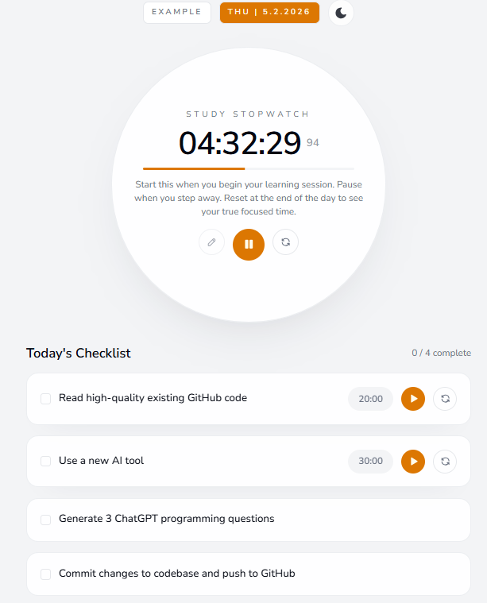
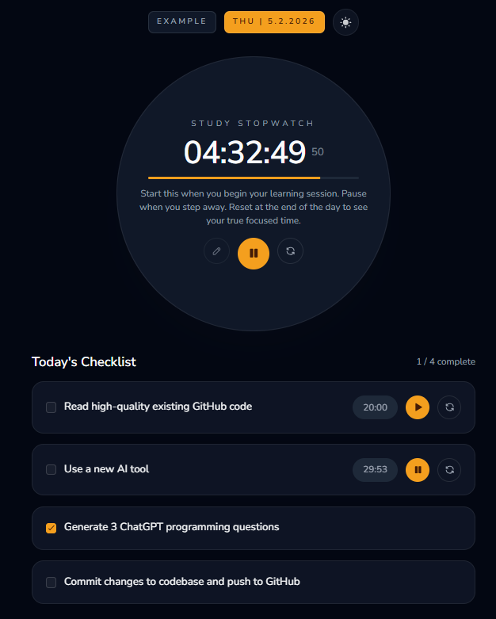
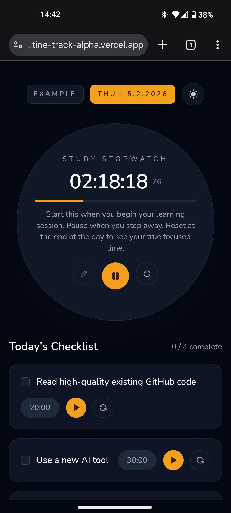
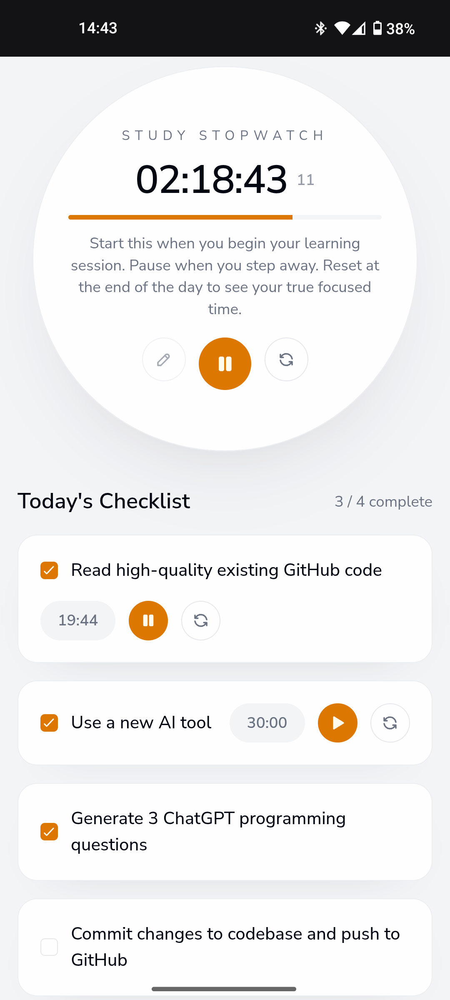
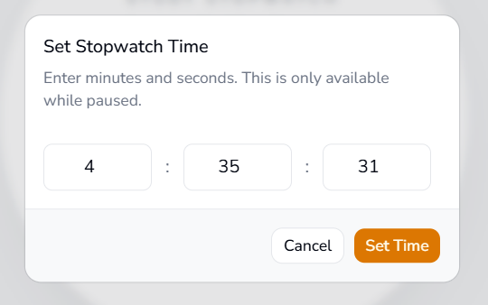
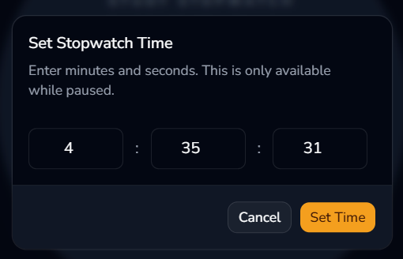

#  Routine Tracker

Minimal daily routine tracker with timers and a study stopwatch.

Tech stack:
- React 19
- TypeScript
- Vite
- Tailwind CSS
- shadcn/ui

Hosted at: <https://routine-track-alpha.vercel.app/>


## Run Locally
```bash
npm install
npm run dev
```


## Screenshots
<table>
  <tr>
    <td></td>
    <td></td>
  </tr>
  <tr>
    <td></td>
    <td></td>
  </tr>
  <tr>
    <td></td>
    <td></td>
  </tr>
</table>
